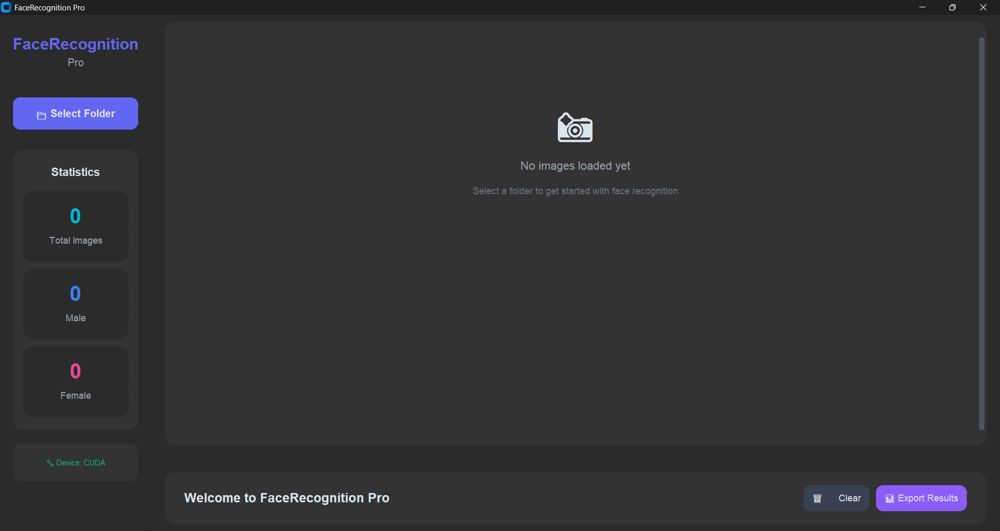
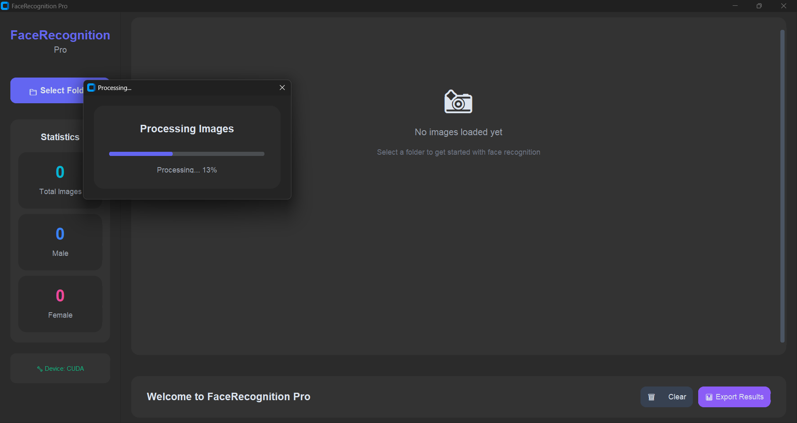
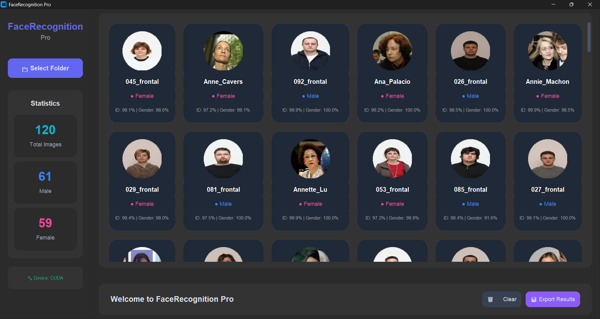

# 🧠 Hackathon AI Face Classifier — TechnicalChads

Developed by **Anirban Roy** and **Tarashankar Mandal**, this project is a Python-based AI classification tool that uses deep learning for face and gender recognition. Built with `facenet-pytorch`, `torch`, and `customtkinter`, it features a minimal UI for batch image analysis.

---

## 🚀 Quick Start Guide

### 1. Clone the Repository
```bash
git clone https://github.com/man4mandal/TechnicalChads.git
```

> Or download the ZIP and extract it to a desired location on your local machine.

### 2. Open the Folder in Your Python IDE

Use VSCode, PyCharm, or any preferred Python editor to open the extracted/cloned folder.

### 3. Open the Main Python File

Inside the folder, open:

```
Hackathon_Final Project.py
```

### 4. Set Up Python Virtual Environment (Python 3.8.10)

In the terminal:
```bash
python -m venv venv
```

Activate the virtual environment:

- **Windows:**
  ```bash
  .\venv\Scripts\activate
  ```
- **macOS/Linux:**
  ```bash
  source venv/bin/activate
  ```

### 5. Install Required Dependencies

```bash
pip install Pillow
pip install customtkinter
pip install torch torchvision
pip install facenet-pytorch
```

### 6. Set File Paths in Code

Update the following variables in `Hackathon_Final Project.py` to match your local directory paths:

```python
face_model_path = r"your_local_path\face_model.pt"
gender_model_path = r"your_local_path\gender_model.pt"
train_folder = r"your_local_path\train_images"
```

> Replace `your_local_path` with the full path where the models and folders are stored on your system.

### 7. Run the Program

```bash
python "Hackathon_Final Project.py"
```

### 8. Choose Test Batch

When the UI launches:

- Select the folder named `test_batch`
- Press **OK**

### 9. ✅ View Final Results

The classification results for the test images will be displayed in the UI.

---

## 📁 Project Structure

```
📦 TechnicalChads/
├── Hackathon_Final Project.py
├── face_model.pt
├── gender_model.pt
├── train_images/
├── test_batch/
├── README.md
```

---

## 🛠 Tech Stack

- Python 3.8.10
- PyTorch
- facenet-pytorch
- CustomTkinter
- Pillow

---

## 📸 UI Preview

1.

2.

3.


> _Add these images to your repo for them to render properly._

---

## 👨‍💻 Team TechnicalChads

| Member              | Role                          |
|---------------------|-------------------------------|
| Anirban Roy         | Programmer, AI & Backend       |
| Tarashankar Mandal  | UI Design, GitHub, Management  |

---

## 📄 License

This project is licensed under the [MIT License](LICENSE).

---

## 🤝 Contributions

Feel free to fork the repo, open issues, or make pull requests to improve this project.

---

## 💡 Tip

Always use raw strings (`r"path\to\file"`) in Python to avoid path formatting issues on Windows.

---

Happy Building! ⚙️✨
